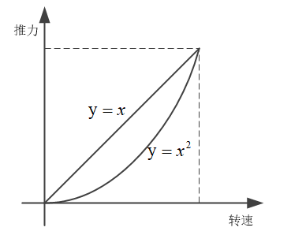

# 螺旋桨推力与转速的关系

* [返回上层目录](../ESC.md)


螺旋桨推力thrust与转速pwm（假设转速正比于pwm）的关系为：
$$
\begin{aligned}
\text{thrust}&=k_1\times C_l \times \text{rpm}^2\\
&=k_2\times C_l \times \text{pwm}^2
\end{aligned}
$$
其中，$C_l$表示升力系数，$\sqrt{\frac{k_2}{k_1}}$为电调输入pwm和转速rpm的正比系数。

但有的电调比如T-model可能会做pwm到推力的线性化




我们需要一个参数a来对直线和平方曲线进行混合，并根据真实值进行曲线拟合，得到最适合的a，但一般来说，0.65适合大部分情况。

即令转速为`p`，推力为`t`，则有
$$
t=(1-a)\cdot p+a\cdot p^2
$$
现在我们想根据推力`t`来求转速`p`：
$$
\begin{aligned}
t&=(1-a)\cdot p+a\cdot p^2\\
&=a(p^2+\frac{1-a}{a}p)\\
&=a(p^2+2bp+b^2)-ab^2\quad \text{assum}\ b=\frac{1-a}{2a}\\
&=a(p+b)^2-ab^2
\end{aligned}
$$
从而
$$
\begin{aligned}
&t=a(p+b)^2-ab^2\\
\Rightarrow&a(p+b)^2=t+ab^2\\
\Rightarrow&p=\sqrt{\frac{t+ab^2}{a}}-b\\
\Rightarrow&p=\sqrt{\frac{t+a(\frac{1-a}{2a})^2}{a}}-\frac{1-a}{2a}\\
\Rightarrow&p=\sqrt{\frac{at+a^2(\frac{1-a}{2a})^2}{a^2}}-\frac{1-a}{2a}\\
\Rightarrow&p=\sqrt{\frac{at+\frac{(1-a)^2}{4}}{a^2}}-\frac{1-a}{2a}\\
\Rightarrow&p=\sqrt{\frac{4at+(1-a)^2}{4a^2}}-\frac{1-a}{2a}\\
\Rightarrow&p=\frac{\sqrt{4at+(1-a)^2}}{2a}+\frac{a-1}{2a}\\
\Rightarrow&p=\frac{a-1+\sqrt{(1-a)^2+4at}}{2a}\\
\end{aligned}
$$
即


上图的python代码如下：

```python
import matplotlib.pyplot as plt
import math
import numpy as np

def apply_thrust_curve_and_volt_scaling(thrust, motors_thrust_curve_expo=0.65):
    motors_lift_max = 1.0
    a = (motors_thrust_curve_expo - 1.0) + math.sqrt((1.0 - motors_thrust_curve_expo)**2 + 4.0 * motors_thrust_curve_expo * thrust)
    b = 2.0 * motors_thrust_curve_expo
    throttle_ratio = a / b
    return throttle_ratio

thrust = np.linspace(0, 1, 1001)
throttle_ratio = [apply_thrust_curve_and_volt_scaling(i) for i in thrust]
sqrt_x = [math.sqrt(i) for i in thrust]

plt.figure()
plt.plot(thrust, sqrt_x, '--g', linewidth=3.0, label='$y=\sqrt{x}$')
plt.plot(thrust, thrust, '--b', linewidth=3.0, label='$y=x$')
LINE_NUM = 5
for i in range(LINE_NUM - 1):
    factor = (i + 1) / LINE_NUM
    thrust = np.linspace(0, 1, 1001)
    throttle_ratio = [apply_thrust_curve_and_volt_scaling(i, factor) for i in thrust]
    plt.plot(thrust, throttle_ratio, '--r')
plt.grid()
plt.xlabel("thrust")
plt.ylabel("throttle_ratio")
plt.title("$pwm=\sqrt{thrust}$")
plt.legend()  # plt.legend(loc='upper left')
plt.show()
```

猜测：

电调电压和转速线性相关？

# 参考资料

* [Using “measured” MOT_THST_EXPO: What improvement can one expect?](https://discuss.ardupilot.org/t/using-measured-mot-thst-expo-what-improvement-can-one-expect/26172)

这里作者讲了对thrust_curve_expo的理解。

> 这是调整飞机的一个极其重要的参数。大多数 ESC 的工作原理是指令输入与用于驱动电机的平均电压大致成正比。这导致每个螺旋桨的强烈非线性推力响应。我使用大约 100 个螺旋桨的测量值得出默认的 MOT_THST_EXPO 值 0.65。基本原则是道具越大价值越高。因此，对于普通 ESC，30" 螺旋桨将更接近 0.8，而 5" 螺旋桨将更接近 0.5。同轴螺旋桨似乎也更低，所以如果我没有测量推力特性，我对大多数同轴设计使用 0.5。
>
> 但是，某些 ESC 似乎会对命令输入进行补偿以尝试使推力值线性化。根据 ESC 和螺旋桨的不同，MOT_THST_EXPO 可以在 -0.3 到 0.5 之间变化。
>
> 另一个改变 MOT_THST_EXPO 值的参数是 MOT_SPIN_MIN 值。因此，如果您增加 MOT_SPIN_MIN，则需要减少完美的 MOT_THST_EXPO。
>
> 因此，正确定义此参数的唯一方法是测量推力曲线并计算 MOT_THST_EXPO。然而，对于大多数 ESC 和螺旋桨组合，默认值会很好地工作。
>
> 那么如何判断这个值是否错误呢？
> 全油门时会出现振荡，或者在低油门时控制很差。
> 您发现如果不重新进行调整就无法更改飞机的起飞重量。
>
> 这两个都假设你在悬停时有一个近乎完美的曲调（我的意思是我对一个近乎完美的曲调的想法）。您还应该在 MOT_ 参数中设置电压补偿功能。
>
> 所以给你一些我调过的飞机的例子。我有悬停油门小于 15% 的飞机，在全油门下不会显示任何振荡迹象，在低油门设置下不会调整或妥协 PID。我的飞机起飞重量可以在 12.5 到 50 公斤之间变化，而无需调整 PID 值。
>
> 我希望这能回答你的问题。

* [MOT_THST_EXPO and need for thrust stand](https://discuss.ardupilot.org/t/mot-thst-expo-and-need-for-thrust-stand/78258)

下面这个xlsx可以自动计算thrust_curve_expo值。

[ArduPilot Motor Thrust Fit.xlsx](https://docs.google.com/spreadsheets/d/1_75aZqiT_K1CdduhUe4-DjRgx3Alun4p8V2pt6vM5P8/edit#gid=0)

* [PX4调参 MC PID Tuning Guide](https://www.bookstack.cn/read/px4-user-guide/zh-config_mc-pid_tuning_guide_multicopter.md#%E6%8E%A8%E5%8A%9B%E6%9B%B2%E7%BA%BF%20/%20%E5%A4%A7%E6%B2%B9%E9%97%A8%20PID%20%E8%A1%B0%E5%87%8F(Throttle%20PID%20Attenuation)%20{#thrust_curve})

这一章：推力曲线 / 大油门 PID 衰减(Throttle PID Attenuation) {#thrust_curve}

> 用 **THR_MDL_FAC**参数来调整[推力曲线](https://www.bookstack.cn/read/px4-user-guide/zh-advanced_config-parameter_reference.md#THR_MDL_FAC)(推荐的方式)。 默认情况下的PWM - 推力 对应关系是线性的。 — 你可以把参数`THR_MDL_FAC`设为1来让这种关系变成二次的。 0~1之间的值表示线性和二次之间的一个插值。 这个参数一般在0.3~0.5之间，你可以每次增加0.1。 如果该参数太大，你可以看到低油门下的振荡现象。


